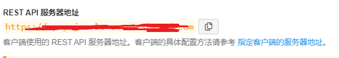

<!-- README.md is generated from README.Rmd. Please edit that file -->

# RleanC

The goal of RleanC is to help R users to simplely retrieve value or data
from LeanCloud. This package is a R wrapper of the RESTful API of
LeanCloud. You can find more about LeanCloud RESTful API at
[here](https://leancloud.cn/docs/rest_api.html)

## Installation

You can install the released version of RleanC by

``` r
# install.packages("devtools")
devtools::install_github("KiayangQ/RleanC")
```

## Example

This is a basic example which shows you how to retrieve your value or
your data from the LeanCloud database

``` r
library(RleanC)

obj <- get_obj(web="severURL",query="name of queried object",ID="AppID", KEY="AppKey")
```

You can find these information after logging in LeanCloud website:
console–App keys. For example:


You can find your server URL on REST API



If you want to retrieve a js dataframe from a online jspsych experiment,
use

``` r

#obj is the output of get_obj

data <- js_data_get(obj)

```
